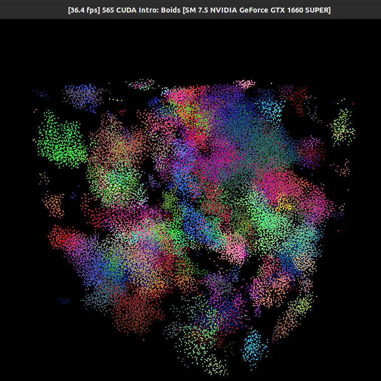

**University of Pennsylvania, CIS 565: GPU Programming and Architecture,
Project 1 - Flocking**

* Matt Elser
  * [LinkedIn](https://www.linkedin.com/in/matt-elser-97b8151ba/)
* Tested on: Ubuntu 20.04, i3-10100F @ 3.6GHz 16GB, GeForce 1660 Super 6GB

)

### (TODO: Your README)

Include screenshots, analysis, etc. (Remember, this is public, so don't put
anything here that you don't want to share with the world.)
